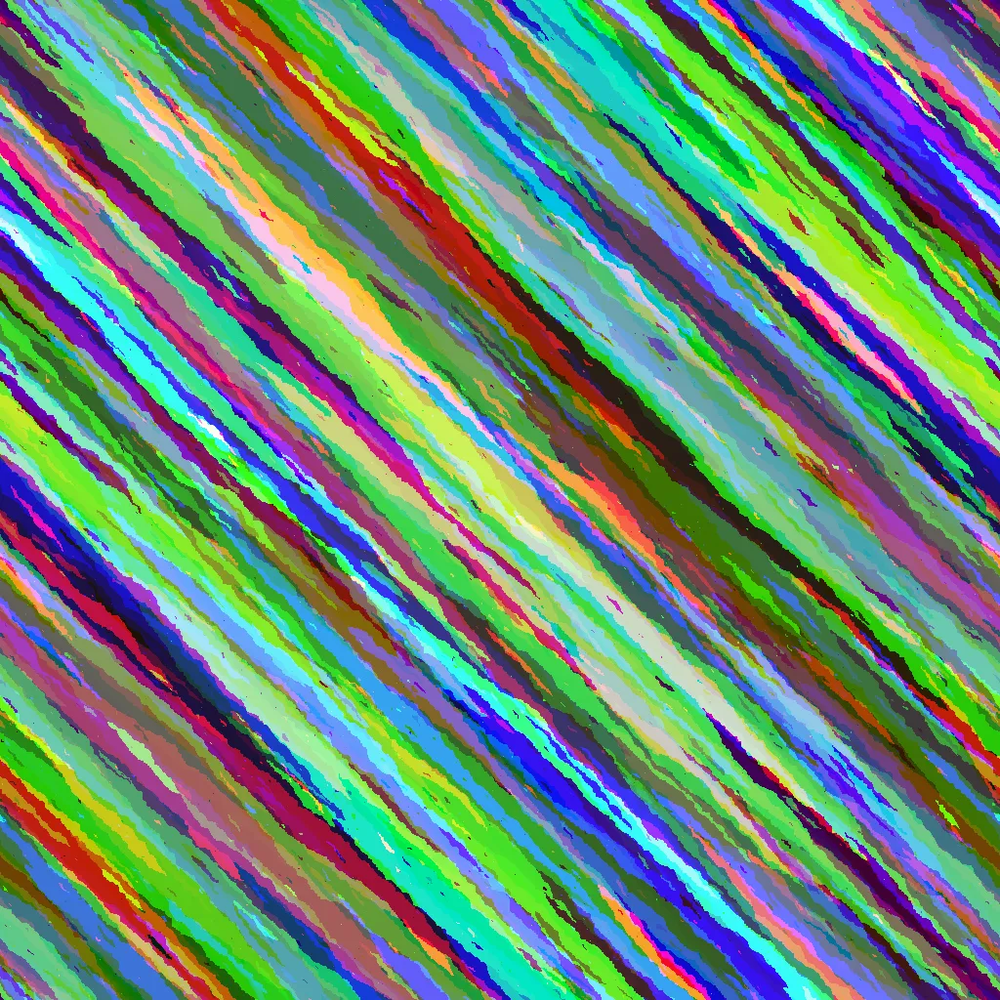

# Introduction
## Summy
This is Chuning liu,rising four-year Computer Science major. Developed experience in programming utilizing mathematical and analytical skills.
**Three years of experience with C++** and **two year of experience with Java**. 
Completed projects related to C with ARM, C++, and Java.
## Relevant Course
Design and Analysis of Algorithms
Computer Graphics
Programming Languages: Principles and Paradigms
Software Project for Computer Architecture
Software Engineering,
Advanced-Data Structures
## Work Experience
I am currently doing an internship at VisionX, 
and my current job is to research the difference between codeless web production 
and coded web production.
## School Project
### Graph Calculator
Designed a project to let users get the image of the function by entering the function expression
- Used LinkedList to build the stack, queue, and other helper classes
- Used the Shunting-yard algorithm and RPN to implement the computation
- Designed in SFML library to build the user interface
- Achieved the function that users can implement algebraic functions and trigonometric functions to get the image and they can view the history in the side bar and use the mouse to click to see the image of the function
### Classroom Scheduler
- Designed an interface that allows users to book the appropriate classroom and time, with priority for each type of
classroom
- Used ArrayList to store different kinds of classroom information. Used java's own GUI for the interface
- Achieved the function that users can choose time and rooms for different activities based on the options in the user
interface. There is a priority between activities. After the user selects, the data is stored in a txt file
### Logo Maker
- Designed a project to allow users to input fonts and work on them using various functions to design a logo that the user
is satisfied with
- Constructed stack and queue using LinkedList. Added functionality using functions and other inherited classes
- Used SFML library to optimize the interface
- Achieved the function that users can input the name of the logo they want to create into the text box, and change the
font size, color, brightness, font rotation, font shading, background color, and font grid style. Users can also read and change the .txt file and take screenshots to save it
### Compress and Decompress
- Designed a project to let user can compress and decompress the required files.
- Constructed the Huffman tree class using the STL library for C++
- Used help class to read bit and write bit for input file. Use Huffman-tree class to encode and decode the file
- Achieved the function that users can compress and decompress .any file such as textfile, video, audio, binary file, etc
## Skills
**Technical Skills:** 

1. C++
2. Java

**Language:**

1. Native in Chinese
2. Fluent in English

## Favorite code

**Here is my favorite code** 

```
unsigned char RD(int i,int j){
#define r(n)(rand()%n)
static char c[1024][1024];return!c[i][j]?c[i][j]=!r(999)?r(256):RD((i+r(2))%1024,(j+r(2))%1024):c[i][j];
}

unsigned char GR(int i,int j){
static char c[1024][1024];return!c[i][j]?c[i][j]=!r(999)?r(256):GR((i+r(2))%1024,(j+r(2))%1024):c[i][j];
}

unsigned char BL(int i,int j){
static char c[1024][1024];return!c[i][j]?c[i][j]=!r(999)?r(256):BL((i+r(2))%1024,(j+r(2))%1024):c[i][j];
}
```
By Martin Büttner.

**Here is the code run result**

Also, here is the link
[Art](https://codegolf.stackexchange.com/questions/35569/tweetable-mathematical-art).
## My GitHub
Here is my Github [Project](https://github.com/JavaPersuader?tab=repositories).
Here is the README.md [README](./README.md)
## Plan
- [x] Have one intern
- [ ] Driving on Route 1
- [ ] Graduate Application Success.
- [ ] Get a new Intern.
